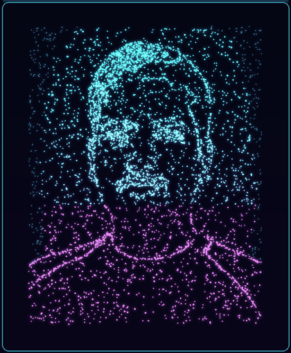

<div align="center">

<!-- Your photo, turned into an animated particle-hologram scan (GIF, included in this repo) -->


<h1>Hi 👋, I'm Onkar Bagade</h1>


<a href="mailto:onkarbagade004@gmail.com">
  
</a>

</div>

<br/>

## 🧬 SYSTEM.INFO

```
Subject     :: Onkar Bagade
Role        :: CS Student (B.Tech, AI & ML)
Focus       :: Python, C++, Algorithms, ML basics
Looking to  :: Collaborate on DEVELOPMENT
Contact     :: onkarbagade004@gmail.com
               
```

- 💻 I'm looking to collaborate on **DEVELOPMENT**
- 📫 How to reach me: **onkarbagade004@gmail.com**

## ⚙️ Languages and Tools

<p align="left">
  <a href="https://www.w3schools.com/cpp/" target="_blank" rel="noreferrer">
    
  </a>
  <a href="https://git-scm.com/" target="_blank" rel="noreferrer">
    
  </a>
  <a href="https://www.python.org" target="_blank" rel="noreferrer">
    
  </a>
</p>

## 📊 GitHub Stats

<p>
  
</p>

<div align="center">
<sub>Built with 🖤 and way too much coffee</sub>
</div>
